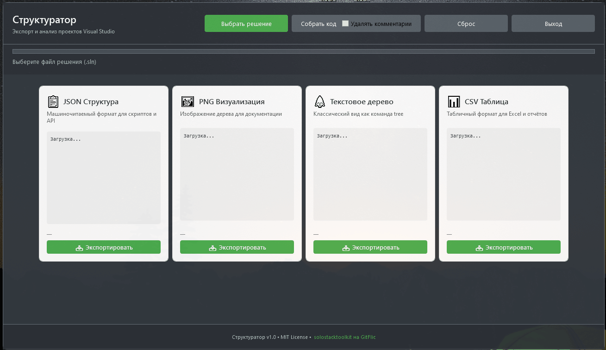

# Структуратор 1.0

[](https://gitflic.ru/project/solostacktoolkit/structurator)
[](https://www.gnu.org/licenses/gpl-3.0.html)
[](https://dotnet.microsoft.com/)
[](https://tbank.ru/cf/3boQYk20Yxc)

#WPF #DotNet #VisualStudio #ProjectStructure #Exporter #Documentation #OpenSource #Russia #GitFlic #Структуратор #JSON #Tree #CSV #Markdown

**Структуратор 1.0** — утилита для экспорта структуры проекта Visual Studio в различные форматы. Создана для разработчиков, технических писателей и студентов, которым нужно быстро получить читаемое представление кодовой базы.

---

## Демонстрация работы



---
<script type="application/ld+json">
{
  "@context": "https://schema.org",
  "@type": "SoftwareSourceCode",
  "name": "Структуратор 1.0",
  "description": "Утилита для экспорта структуры проекта Visual Studio в форматы JSON, PNG, Tree, CSV и Markdown. Поддержка MVVM, .NET 10, WPF, очистка комментариев.",
  "author": {
    "@type": "Person",
    "name": "Зиновьев Артём Александрович",
    "url": "https://gitflic.ru/user/solostacktoolkit"
  },
  "creator": {
    "@type": "Organization",
    "name": "solostacktoolkit"
  },
  "codeRepository": "https://gitflic.ru/project/solostacktoolkit/structurator",
  "programmingLanguage": "C#",
  "runtimePlatform": [".NET 10.0", "WPF"],
  "operatingSystem": "Windows",
  "keywords": "WPF, C#, DotNet, VisualStudio, ProjectStructure, Exporter, JSON, Tree, CSV, Documentation, MVVM, Russia, GitFlic, Markdown, CodeAnalysis",
  "license": "https://www.gnu.org/licenses/gpl-3.0.html",
  "version": "1.0.0",
  "dateCreated": "2026-03-09",
  "applicationCategory": "DeveloperApplication",
  "softwareRequirements": ".NET 10.0-windows",
  "featureList": [
    "Экспорт в 4 формата: JSON, PNG, Tree, CSV",
    "Сбор кода в Markdown для удобства",
    "Селективная очистка комментариев",
    "Поддержка больших решений с прогресс-баром",
    "MVVM-архитектура с зависимостями",
    "Тёмная тема с зелёными акцентами",
    "Перетаскивание окна без заголовка",
    "Полностью отечественная разработка"
  ]
}
</script>

---

## Возможности

| Функция | Описание |
|---------|----------|
| **4 формата экспорта** | JSON, PNG, Tree, CSV — под любые задачи |
| **Сбор кода** | Markdown файл со всем кодом проекта |
| **Очистка комментариев** | Удаление шума с сохранением TODO и документации |
| **Быстрый анализ** | Прогресс-бар и статус для больших решений |
| **MVVM архитектура** | Чистый код с привязками и командами |
| **Современный UI** | Тёмная тема, плавные переходы, адаптивность |
| **Простое использование** | Выбрал решение → нажал экспорт → готово |
| **Сделано в России** | Полностью отечественная разработка |

---

## Поддержать проект

Структуратор 1.0 — проект с открытым исходным кодом, который развивается благодаря энтузиазму автора. Если вы используете эту утилиту и она экономит вам время, пожалуйста, поддержите развитие проекта!

**На что пойдут средства:**
- **Сервер и хостинг** — для размещения документации и CI/CD (15,000 ₽/год)
- **Доменное имя** — structurator.ru для профессионального присутствия (5,000 ₽/год)
- **SaaS платформа** — разработка веб-версии для командной работы (20,000 ₽)
- **NuGet пакет** — публикация и поддержка пакета (5,000 ₽/год)
- **Инфраструктура** — тестирование на разных версиях .NET (5,000 ₽)

**Итого: 50,000 ₽** — это обеспечит развитие проекта на ближайшие 2 года!

[](https://tbank.ru/cf/3boQYk20Yxc)

---

## Установка

### Скачать готовую версию

1. Перейдите в раздел [Релизы](https://gitflic.ru/project/solostacktoolkit/structurator/releases)
2. Скачайте архив с последней версией
3. Распакуйте и запустите `StructureSnap.exe`

### Сборка из исходников

```bash
# Клонирование репозитория
git clone git@gitflic.ru:solostacktoolkit/structurator.git
cd structurator

# Восстановление зависимостей
dotnet restore

# Сборка релизной версии
dotnet publish -c Release -r win-x64 --self-contained false

# Запуск
cd bin/Release/net10.0-windows/publish
./StructureSnap.exe
```

---

## Быстрый старт

### 1. Запустите приложение

```bash
StructureSnap.exe
```

### 2. Выберите решение

Нажмите **«Выбрать решение»** и укажите файл `.sln` или `.slnx` вашего проекта.

### 3. Экспортируйте структуру

Выберите формат и нажмите **«Экспорт»**:

| Формат | Для чего подходит |
|--------|-------------------|
| **JSON** | Машиночитаемый экспорт, интеграции, API |
| **Tree** | Читаемое текстовое дерево (как в консоли) |
| **PNG** | Визуальная схема для документации |
| **CSV** | Таблицы для Excel и отчётов |
| **Markdown** | Полный код проекта |

### 4. Собрать код 

1. Отметьте чекбокс **«Удалить плохие комментарии»** (опционально)
2. Нажмите **«Собрать код»**
3. Получите файл `{ИмяРешения}_Structure_{дата}.md`

---

## Пример вывода (Tree)

```
MySolution.sln
├── MyProject.Core/
│   ├── Models/
│   │   ├── User.cs
│   │   └── Product.cs
│   ├── Services/
│   │   └── DataService.cs
│   └── MyProject.Core.csproj
├── MyProject.UI/
│   ├── Views/
│   │   └── MainWindow.xaml
│   └── MyProject.UI.csproj
└── tests/
    └── MyProject.Tests/
        └── UnitTest1.cs
```

---

## Структура проекта

```
└─ 📄 structurator
   ├─ 📄 App.xaml.cs
   ├─ 📄 AssemblyInfo.cs
   ├─ 📁 Models
   │  ├─ 📄 CardPreviewData.cs
   │  ├─ 📄 ExportFormat.cs
   │  └─ 📄 ProjectNode.cs
   ├─ 📁 Services
   │  ├─ 📄 CodeCollectorOptions.cs
   │  ├─ 📄 CodeCollectorService.cs
   │  ├─ 📄 CollectedCodeFil.cs
   │  ├─ 📄 ExportService.cs
   │  ├─ 📄 ICodeFormatter.cs
   │  ├─ 📄 IExportService.cs
   │  ├─ 📄 IPreviewGenerator.cs
   │  ├─ 📄 IProjectParser.cs
   │  ├─ 📄 LlmMarkdownFormatter.cs
   │  ├─ 📄 PreviewGenerator.cs
   │  └─ 📄 ProjectParser.cs
   ├─ 📁 ViewModels
   │  ├─ 📄 CardViewModel.cs
   │  ├─ 📄 MainViewModel.cs
   │  └─ 📄 RelayCommand.cs
   ├─ 📁 Views
   │  ├─ 📁 Controls
   │  │  ├─ 📄 FormatCard.xaml.cs
   │  │  └─ 📄 FormatCard.xaml
   │  ├─ 📄 MainWindow.xaml.cs
   │  └─ 📄 MainWindow.xaml
   ├─ 📄 .gitattributes
   ├─ 📄 .gitignore
   ├─ 📄 App.ico
   ├─ 📄 README.md
   └─ 📄 App.xaml
```

---

## Требования

- **.NET 10.0 Desktop Runtime** или выше
- **Windows 10/11**
- **Visual Studio 2022 / Visual Studio 2026** (для открытия решений)

---

## Зависимости

```xml
<PackageReference Include="Microsoft.Build.Locator" Version="1.11.2" />
<PackageReference Include="Microsoft.Build" Version="18.4.0" ExcludeAssets="runtime" />
<PackageReference Include="System.Drawing.Common" Version="10.0.5" />
<PackageReference Include="System.Text.Json" Version="10.0.5" />
```

---

## Использование API

### Пример программного вызова

```csharp
using StructureSnap.Services;
using StructureSnap.Models;

var parser = new ProjectParser();
var tree = await parser.LoadSolutionAsync("MySolution.sln", null, CancellationToken.None);

var exporter = new ExportService();
var format = new ExportFormat { Id = "json", FileExtension = ".json" };

var result = await exporter.ExportAsync(format, tree, "output.json", CancellationToken.None);

if (result.Success)
{
    Console.WriteLine($"Экспорт завершён: {result.OutputPath}");
}
```

---

## Как внести вклад

Мы приветствуем вклад в развитие проекта! Пожалуйста, следуйте этим правилам:

### Условия участия

1. **Форкните репозиторий** на [GitFlic](https://gitflic.ru/project/solostacktoolkit/structurator)
2. **Сделайте fork публичным** (требование лицензии GPL-3.0)
3. **Укажите авторство**: Зиновьев Артём Александрович
4. **Распространяйте производные работы под лицензией GPL-3.0**
5. **Создайте ветку** (`git checkout -b feature/amazing-feature`)
6. **Закоммитьте изменения** (`git commit -m 'Add: amazing feature'`)
7. **Запушьте ветку** (`git push origin feature/amazing-feature`)
8. **Откройте Pull Request**

### Правила коммитов

- Используйте префиксы: `Add:`, `Fix:`, `Update:`, `Refactor:`, `Docs:`
- Описывайте изменения понятно и подробно
- Ссылайтесь на Issues при наличии

---

## Сообщить об ошибке

[Создайте Issue на GitFlic](https://gitflic.ru/project/solostacktoolkit/structurator/issues)

**Укажите:**
- Версию приложения
- Шаги воспроизведения
- Ожидаемый результат
- Фактический результат
- Скриншот (если есть)
- Логи из Debug Console

---

## Лицензия

**GNU General Public License v3.0 (GPL-3.0)**

Copyright (c) 2026 Зиновьев Артём Александрович

Эта программа является свободным программным обеспечением: вы можете распространять и/или изменять её в соответствии с условиями GNU General Public License, опубликованной Free Software Foundation, либо версии 3 Лицензии, либо (по вашему выбору) любой более поздней версии.

### Вы можете:
- **Использовать** — в личных и коммерческих целях
- **Изучать** — исходный код открыт для анализа
- **Изменять** — модифицировать под свои нужды
- **Распространять** — делиться оригиналом или модификациями

### При условии:
- **Атрибуция** — вы должны указать **автора: Зиновьев Артём Александрович**
- **Copyleft** — если вы распространяете модифицированную версию, вы должны:
  - Сделать **исходный код открытым**
  - Распространять под **той же лицензией GPL-3.0**
  - Предоставить получателям те же права, что получили вы
- **Уведомление об изменениях** — рекомендуется указывать, какие изменения были внесены

### Это означает:
- ✅ Вы можете использовать в коммерческих проектах
- ✅ Вы можете модифицировать код
- ❌ Вы **не можете** закрывать исходный код производных работ
- ❌ Вы **не можете** распространять под другой лицензией

### Полный текст лицензии:
[https://www.gnu.org/licenses/gpl-3.0.html](https://www.gnu.org/licenses/gpl-3.0.html)


## ⭐ Поддержка проекта

Если вам нравится Структуратор 1.0:

1. **Поставьте звезду** на [GitFlic](https://gitflic.ru/project/solostacktoolkit/structurator)
2. **Расскажите коллегам** в чатах и соцсетях
3. **Сообщайте об ошибках** в Issues
4. **Предложите идею** для нового формата экспорта
5. **Поддержите финансово** — [https://tbank.ru/cf/3boQYk20Yxc](https://tbank.ru/cf/3boQYk20Yxc)

---

## Статистика проекта

| Метрика | Значение |
|---------|----------|
| **Всего файлов** | 24 |
| **Всего строк кода** | ~4,200 |
| **Язык** | C# 12 |
| **Платформа** | WPF + .NET 10 |
| **Поддерживаемых форматов** | 5 (JSON, PNG, Tree, CSV, Markdown) |
| **Поддерживаемых расширений** | 40+ |
| **Дата создания** | 2026-03-09 |
| **Последнее обновление** | 2026-03-29 |

---

## Roadmap

### v1.1.0 (Q2 2026)
- [ ] Веб-интерфейс (Blazor)
- [ ] CLI версия для CI/CD
- [ ] Поддержка .slnx без MSBuild
- [ ] Экспорт в PDF

### v1.2.0 (Q3 2026)
- [ ] Интеграция с GitHub/GitLab API
- [ ] Автоматическая генерация CHANGELOG
- [ ] Поддержка плагинов
- [ ] Мультиязычность (EN/RU)

### v2.0.0 (Q4 2026)
- [ ] SaaS платформа для команд
- [ ] Облачное хранение экспортов
- [ ] Совместный доступ
- [ ] API для интеграций

---

## 👤 Автор

**Зиновьев Артём Александрович**

- **GitFlic**: [@solostacktoolkit](https://gitflic.ru/user/solostacktoolkit)
- **Проекты**: Структуратор 1.0, NovaFlowWPF, и другие
- **Связь**: через Issues на GitFlic

---

## 🙏 Благодарности

- **Microsoft** — за отличную платформу .NET и Visual Studio
- **GitFlic** — за российскую платформу для хостинга кода
- **Сообщество** — за обратную связь и предложения
- **Все, кто поддерживает проект!** ❤️

---

#WPF #DotNet #VisualStudio #ProjectStructure #Exporter #Documentation #OpenSource #Russia #GitFlic #Структуратор #JSON #Tree #CSV #Markdown #CodeAnalysis #DeveloperTools #GPL

**Сделано в России 🇷🇺 с любовью к разработчикам**

**Лицензия: GPL-3.0 © 2026 Зиновьев Артём Александрович**
```
